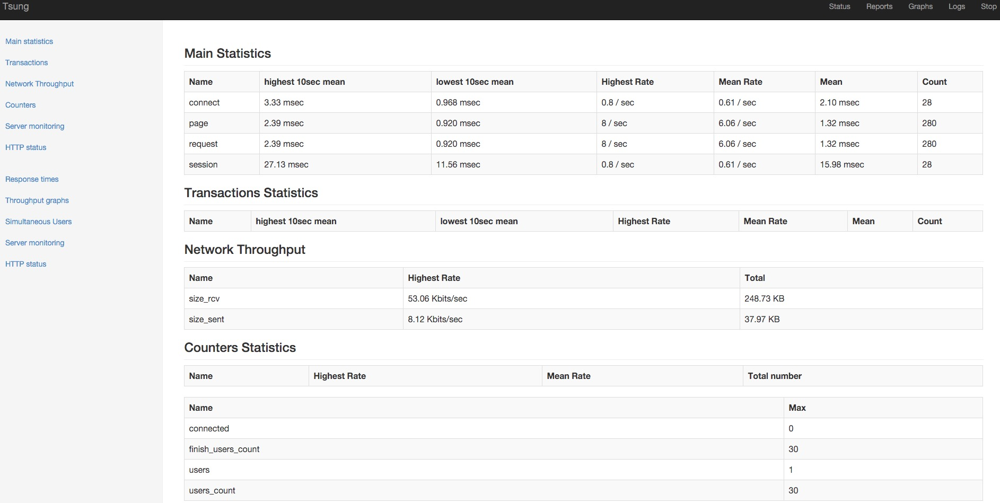
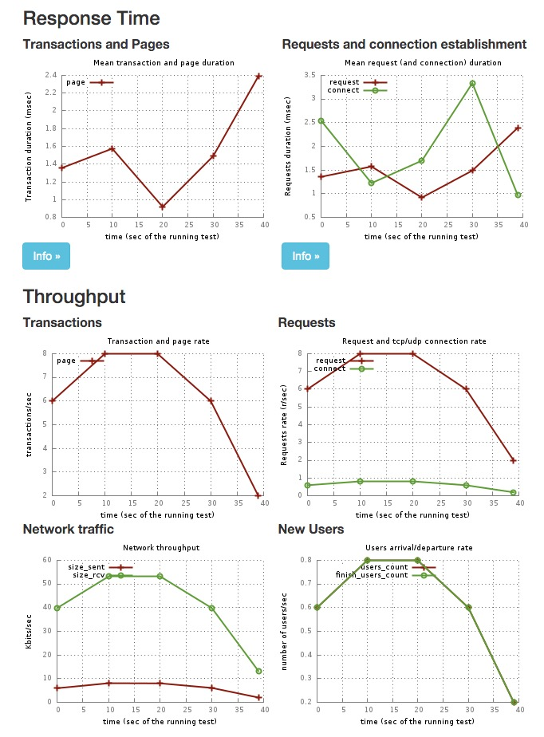

# Tsung-1.6.0 官方手册
## 1 什么是 [Tsung](http://tsung.erlang-projects.org/)
Tsung是基于 Erlang 的一个开源分布式多协议的负载测试工具，可以支持 HTTP, WebDAV, SOAP, PostgreSQL, MySQL, LDAP and Jabber/XMPP，只要硬件足够可以支撑几十万到上百万的压力。
## 2 特点
### 2.1 tsung 主要特点
- 高性能
 
    可以在一个单CPU模拟成千上万的用户（模拟用户不总是活动的，它可以在一个thinktime 期间空闲）传统的工具也很难再超过几十万（提示：如果你想要做的就是要求循环请求一个简单的URL可以使用AB，但如果你想建立一个复杂的环境，并且得到测试报告，可以选择Tsing）
- 分布式

    利用集群提供负载
- 使用插件系统实现多协议

    HTTP（包括标准的网络流量和SOAP），WebDAV，Jabber / XMPP协议和PostgreSQL目前都支持。实验版LDAP和MySQL的插件包括在1.3.0版本。
- SSL支持

    使用操作系统的别名机制

- 使用erlang代理或snmp 监控操作系统（CPU、内存、流量）
- XML格式的配置文件
    
    使用xml来完成复杂用户的配置。使用tsung  recorder（录制）完成复杂环境的配置。(HTTP and PostgreSQL only).
- 动态场景

    可以不用写任何代码来是到服务器在压力下的动太数据，并可以后边的请求重新注入。也可以循环，当分（正则）匹配到服务器返回的字符串时重新启动或停止会话。
- 混合行为

    在同一个测试基准中，可以使用多个sessions来模拟不同类型的用户。并可以定义各种行为的比例。
- 随机过程

    产生一个接近真实的流量，用户thinktimes和到达率可使用随机概率分布（目前使用指数）

### 2.2 HTTP
- HTTP/1.0 　 HTTP/1.1  支持
- GET, POST, PUT, DELETE and HEAD 请求
- Cookies:自动cookies 管理。也可以手动增加多个cookies
- GET If-modified since 类型的请求
- WWW基本认证
- 用户代理支持
- 可以增加一些HTTP　 Headers
- 使用代理模式用web浏览器记录会话
- SOAP支持使用HTTP模式（HTTP头SOAPAction的处理）
- HTTP服务器或代理服务器的负载测试

### 2.3  WEBDAV
WEBDAV（HTTP 1.1的扩展，WebDAV（RFC4918）插件是对HTTP超插件,增加了以下功能

- Methods implemented: DELETE, CONNECT, PROPFIND, PROPPATCH, COPY, MOVE, LOCK, UNLOCK, MKCOL, REPORT, OPTIONS, MKACTIVITY, CHECKOUT, MERGE
- Recording of DEPTH, IF, TIMEOUT OVERWRITE, DESTINATION, URL and LOCK-TOKEN Headers.

### 2.4  Jabber/XMPP
- 验证(plain-text, digest and sip-digest)
- presence and register messages
- 聊天信息发送给在线或离线用户
- MUC的：加入房间，房间里发送消息，更改昵称
- Roster set and get requests
- Global users' synchronization can be set on specific actions
- 原始XML消息
- PubSub
- 支持多个虚拟主机的实例

### 2.5  PostgreSQL
- 基本验证和MD5验证
- 基本查询（扩展查询暂不支持）
- 代理模式录制session

### 2.6 mysql 相关功能
这个插件是实验性的，它只能使用在mysql4.1及以上版本

- 安全身份验证方法
- 基本查询

### 2.7 Websocket
这个插件是实验性的，只支持 RFC 6455.作用于服务器类型，工作原理类似tcp和udp传输，任何应用特殊协议数据可以通过它发送。例子在examples/websocket.xml.

- 服务器类型和会话类型 

### 2.8 AMQP
这个插件是实验性的，只支持 AMQP-0.9.1，例子在 examples/amqp.xml.

- 基本的发布和消费
- 发布确认和消费ack
- Qos

### 2.9 MQTT
这个插件是实验性的，支持 MQTT V3.1，例子 examples/mqtt.xml.

- 链接 MQTT broker 与选项
- 发布信息到 broker
- 话题订阅和退订
- 支持qos0和1

### 2.10 LDAP相关功能
这个插件是实验性的

- Bind
- Add, modify and search queries
- starttls (only with R12B-0 Erlang and up)

### 2.11 原生插件
- 兼容 tcp/udp/ssl
- 愿信息
- no_ack,local,global ack 信息

### 2.12 完成的报告
Tsung所产生的行为和报告是非常完整的，它们全为图形显示。Tsung的统计方面如下：

- 性能
    
    响应时间（response time），连接时间（connection time），根据用户的要求建立分组方案(called transactions),，第秒请求
- 错误
    
    通过统计页返回代码来跟踪错误。
- 目标服务器行为
     
     一个Erlang代理，可以收集到来自目标服务器（S）的信息，Tsung生成内存消耗，CPU和网络流量图。
- 还支持SNMP和munin 监控远程服务器。

注意：TSUNG注意到了同步过程本身，所收集的统计到synchronized.它可以是实时收集统计中的基准线。

### ２.13　亮点
Tsung 与其它注入工具相比的几个优点

- 高性能和分布式：你可以用TSUNG模拟成千上万的虚拟用户。
- 易于使用：于对协议的支持已经完成。无需编写复杂的脚本。如果在动态的情况下，只需一些小段的代码。
- 多协议支持：例如，对于SOAP应用程序，tsung是唯一的工具。
- 目标服务器的监测，分析，并发现瓶颈。例如：它已经被用来分析集群对称（负载平衡测试）。并确定集群层（Web engine, EJB engine and database）上机器的最佳组合。

## 3 安装
### 3.1 依赖
- Erlang/OTP R14B 及以上版本。[download](http://www.erlang.org/download.html). Erlang是现在Fedora和Debian / Ubuntu的仓库的一部分。
- Pgsql模块由Christian Sunesson开发 (for the PostgreSQL plugin) 源可用。http://jungerl.sourceforge.net/,这个模块以源代码和二进制发布，它以EPL协议发布。
- Mysql模块由Magnus Ahltorp & Fredrik Thulin开发。(for the mysql plugin):源可用。http://www.stacken.kth.se/projekt/yxa/ 修改后的模块被包含在tsung源代码和二进制中。It is released under the three-clause  BSD License.
- Eldap 模块(for the LDAP plugin):源可用http://jungerl.sourceforge.net/ .
这个模块被包含在源和二进制发布中，以GPL协议发布。
- Mochiweb 库 （Xpath 解析 可以在HTTP插件中使用动态变量）源可用,http://code.google.com/p/mochiweb/ 以 MIT 发布。
- gnuplot 和 perl5（图形输出脚本）模板工具包用于生成HTML报告。[see](http://template-toolkit.org/)
- python and mathplotlib  tsung绘图
- 分布式测试，需要SSH无密码方式连接到远程机器 (使用 RSA/DSA 无密码或ssh-agent) (rsh 也支持)
- Bash 

### 3.2 编译
源码编译使用最新版本的到[下载地址](http://tsung.erlang-projects.org/dist/)或者使用[git](https://github.com/processone/tsung)下载编译。当然也可以使用deb或者rpm安装。
### 3.3 配置
默认配置文件在`~/.tsung/tsung.xml` (样例文件在`/usr/share/doc/tsung/examples`).

日志文件被保存在`~/.tsung/log/`使用当前的日期为名称的新子目录中，例如`~/.tsung/log/20040217-0940.`
### 3.4 运行 
运行命令在`$PREFIX/bin`目录中，分别是`tsung`和`tsung-recorder`

    $ tsung -h
    Usage: tsung <options> start|stop|debug|status
    Options:
    -f <file>     set configuration file (default is ~/.tsung/tsung.xml)
                   (use - for standard input)
    -l <logdir>   set log directory where YYYYMMDD-HHMM dirs are created (default is ~/.tsung/log/)
    -i <id>       set controller id (default is empty)
    -r <command>  set remote connector (default is ssh)
    -s            enable erlang smp on client nodes
    -p <max>      set maximum erlang processes per vm (default is 250000)
    -X <dir>      add additional erlang load paths (multiple -X arguments allowed)
    -m <file>     write monitoring output on this file (default is tsung.log)
                   (use - for standard output)
    -F            use long names (FQDN) for erlang nodes
    -L <lifetime> SSL session lifetime (600sec by default)
    -w <delay>    warmup delay (default is 1 sec)
    -n            disable web GUI (started by default on port 8091)
    -k            keep web GUI (and controller) alive after the test has finished
    -v            print version information and exit
    -6            use IPv6 for Tsung internal communications
    -x <tags>     list of requests tag to be excluded from the run (separated by comma)
    -h            display this help and exit

典型的使用方法为:`tsung -f myconfigfile.xml start`,测试完毕后，将生成日志到测试主机目录，默认情况运行中将打开监听页面在主控机，监听端口`8091`，可以使用`-n`关闭
## 4 基准方法
### 4.1 HTTP/ WebDAV
#### 4.1.1 基准测试Web服务器
- 录制一个或多个会话：启动记录器`tsung-recorder start`，并且配置浏览器使用tsung代理记录器（监听端口是8090).将创建一个会话文件.对于HTTPS录音，使用`http://-`而不是`https://`
- 编辑/整理在配置文件中添加记录的会话
- 如果在场景中需要动态标记的话，写动态部分的代码。
- 测试并调整方案以得到更好的结果。这些高度依赖应用程序和目标服务器的规模。在正常情况下，使用户和各阶段的间隔时间来估计每个特定阶段的并发用户数。
- 启动第一个应用程序的参数设置基准`tsung start`
- 等待测试结束或手动停止.（报告也可在测试过程中产生的 (see § 7)）每10秒更新统计数据。对于当前活动的简要介绍，使用`tsung status`
- 分析结果，改变参数并重新启动另一个基准

#### 4.1.2 WEBDAV 
它和HTTP相同的方法：首先启动录制机，录制一个或多个会话,`tsung-recorder -p webdav start`
#### 4.1.3 基准代理服务器
默认情况下，HTTP插件被用来基准测试HTTP服务器。但也可以测试HTTP代理服务器。但需要添加选项部分：

      <option type="ts_http" name="http_use_server_as_proxy" value="true"></option>
### 4.2 LDAP基准测试
对于录制机的LDAP插件还没有实现，因此你必须自己写会话，更多信息请参见6.6.6小节。
### 4.3 PostgreSQL的基准测试方法
和HTTP有相同的方法：首先开始录制机记录一个或多个会话,`tsung-recorder -p pgsql start`

将启动一个代理监听端口8090，将代理请求转到本机的`5432`端口。如果要选择另外的端口和地址`tsung-recorder -L 5432 -I 10.6.1.1 -P 5433 -p pgsql start`这将启动代理监听端口`5432`，将代理请求转到`10.6.1.1:5433`。
### 4.4MYSQL 基准测试
对于mysql的录制机插件还没有完成。因此你必须自己写SESSION。see section 6.6.5 for more information.
### 4.5  Jabber/XMPP 基准测试
#### 4.5.1 概述
本段介绍如何编写的Jabber / XMPP session
在HTTP 和 Jabber 测试中有两个差异：

- 对于jabber没有录制机，因此你必须自己写SESSION，(an example is provided in 6.6.3)
- Jabber的插件不解析XML，相反，它使用数据包确认。

#### 4.5.2 后续暂无翻译
[翻译地址](http://tsung.erlang-projects.org/user_manual/benchmark.html)
### 5.使用代理记录
录制机有三个插件：HTTP, WebDAV 和 for PostgreSQL.

启动方式`tsung-recorder -p <PLUGIN> start`插件选项支持HTTP\WebDAV\pgSQL,默认是HTTP。这个代理的监听端口是`8090`，可以使用 `-L portnumber` 来改变端口。

停止命令`tsung-recorder stop`

这个session的记录被创建在`~/.tsung/tsung_recorderYYYMMDD-HH:MM.xml`;如果启动出错，查看日志`~/.tsung/log/tsung.log-tsung_recorder@hostname`

在录制过程中，你可以参加自定义的tag在XML配置文件中。可以设置注释和插入标签`tsung-recorder record_tag "<transaction name=’login’>’`

一但创建一个会话，你可以插入你的主配置文件。可以手工编辑文件。或通过一个实体声明如：

    <!DOCTYPE tsung SYSTEM "/usr/share/tsung/tsung-1.0.dtd" [
      <!ENTITY mysession1 SYSTEM "/home/nniclausse/.tsung/tsung_recorder20051217-13:11.xml">
    ]>
    ...
    <sessions>
      &mysession1;
    </sessions>
#### 5.1 PostgreSQL
代理将链接`127.0.0.1:5432`,使用 `-l server IP` 修改ip地址，使用`-P`修改端口。
#### 5.2 HTTP and WEBDAV
对于https录制，在你的游览器里，请使用http://- 而不是使用https://，在新的1.2.2版本中，对于HTTP,可以配置录制的父代理(但不能工作在https)。添加方法 `-u` 来打开父代理，使用 `-l server IP` 修改ip地址，使用`-P`修改端口。
## 6 XML 配置文件
## 7 统计报表和报告
### 7.1 文件格式
默认情况下，tsung 使用自己的格式，从1.4.2版本后，可以使用json格式，然而json格式不支持自带报表自动生成工具： tsung_stats.pl和tsung_plotter

启动json方法

    <tsung backend="json" ...>
格式
    
    {
     "stats": [
     {"timestamp": 1317413841,  "samples": []},
     {"timestamp": 1317413851,  "samples": [
       {"name": "users", "value": 0, "max": 0},
       {"name": "users_count", "value": 0, "total": 0},
       {"name": "finish_users_count", "value": 0, "total": 0}]},
     {"timestamp": 1317413861,  "samples": [
       {"name": "users", "value": 0, "max": 1},
       {"name": "load", "hostname": "requi
       ....
### 7.2. 可用信息
平均响应时间(对于页面和请求)每十秒计算和重置。1.3.0版本对于整个测试平均值还有计算

参数| 解释 | 中文解释
:----------- | :-----------: | -----------:
request         | Response time for each request| 每个请求响应时间
page         | Response time for each set of requests (a page is a group of request not separated by a thinktime).| 每组请求响应时间
connect         |  Duration of the connection establishment. | 每个连接建立时间
reconnect         | Number of reconnection | 重新连接数量
size_rcv         | Size of responses in bytes| 接受请求大小
size_sent         | Size of responses in bytes| 发送请求大小
session         | Duration of a user’s session | 用户会话保持时间
users         | Number of simultaneous users | 同步用户数，会话启动算
connected         | number of users with an opened TCP/UDP connection | tcp/udp 打开连接数(http 思考时间＋tcp连接可以由服务器关闭，不会倍重新打开，直到思考时间国旗)
custom transactions|custom transactions|定制事务
#### 7.2.1. HTTP specific stats
每个响应状态(200,304等)的计数器
#### 7.2.2. Jabber specific stats
#### 7.2.3. 系统监控信息
- {load,<host>} 最后一分钟的平均负载
- {cpu,<host} cpu百分比，双核100%代表2个核心都被用了100%
- {freemem,<host>}  内存

### 7.3. Design
### 7.4. 生成报告
在日志目录例如`~/.tsung/log/20040325-16:33/`使用`tsung_stats.pl`
    
    /usr/lib/tsung/bin/tsung_stats.pl
注意运行时也可以生成，使用 -help 参数查看
### 7.5. 总结

### 7.6 图形预览
输出图形数据

### 7.7 绘图
tsplot 是合并绘图绘图工具，可以从几个文件中汇聚一个图标进行分析比对，可以通过配置文件轻松定制想要的曲线.

    tsplot "First test" firsttest/tsung.log "Second test" secondtest/tsung.log -d outputdir
生成图表的例子

       