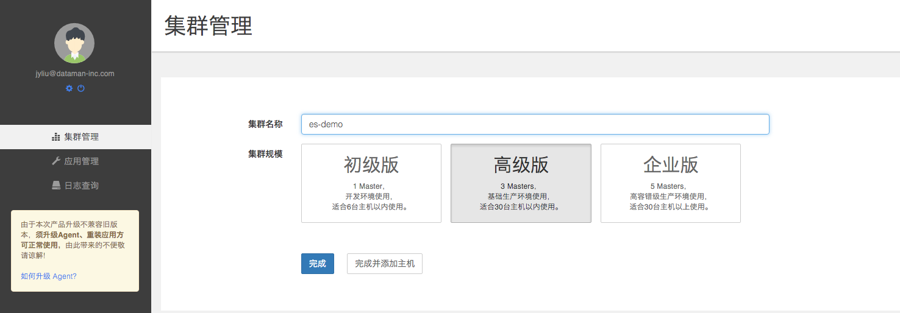
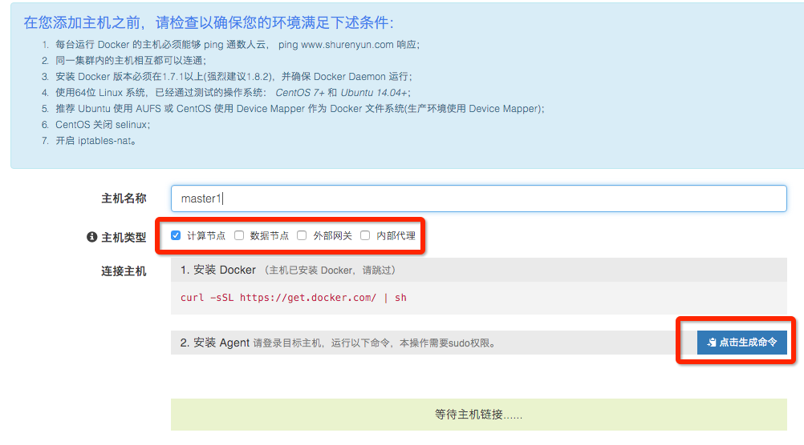
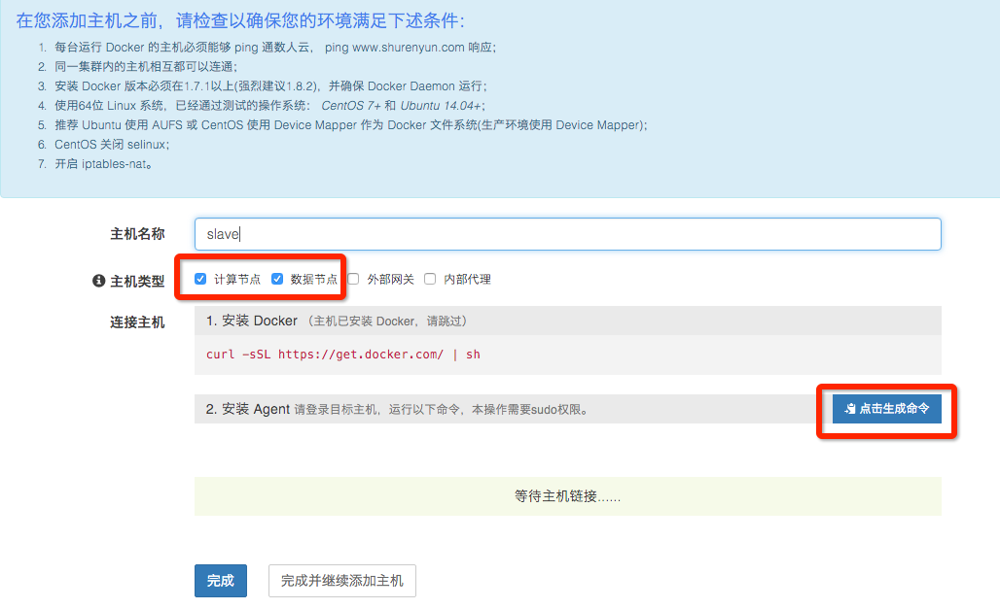
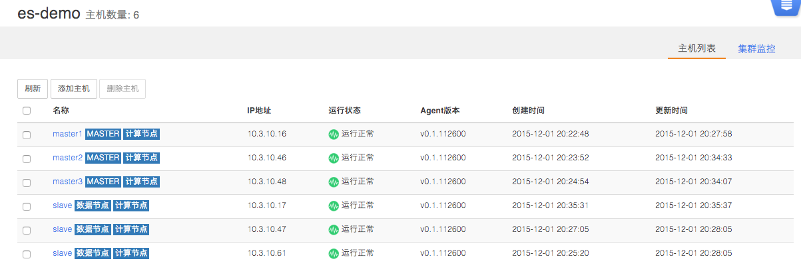
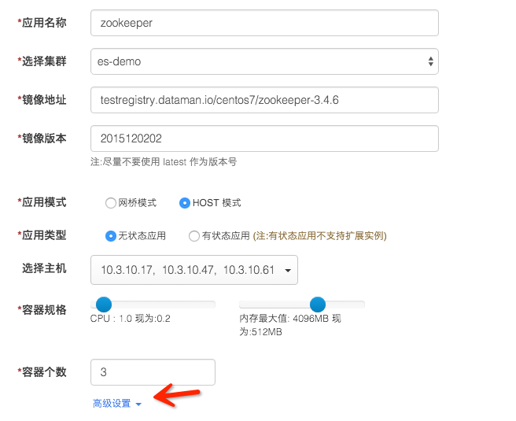
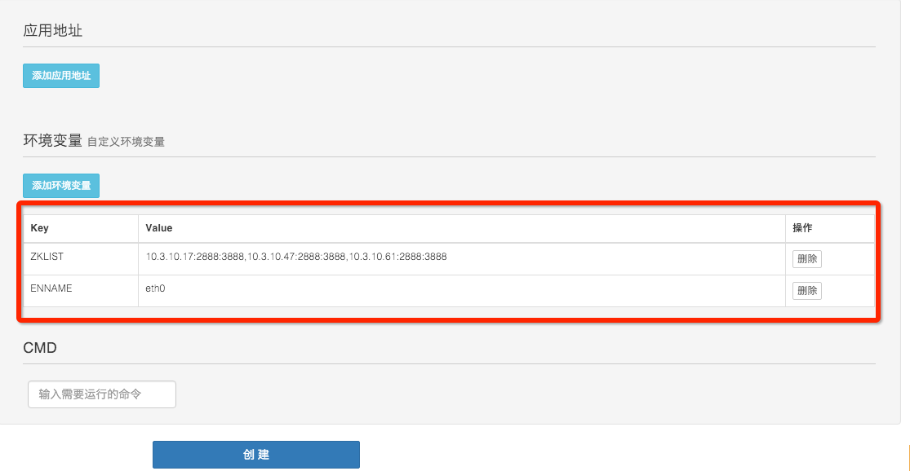
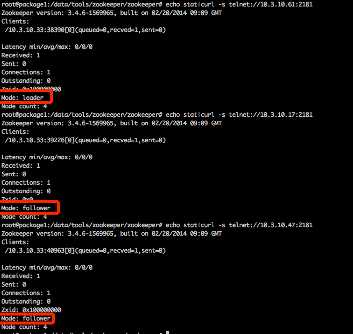

## 第一步 建立集群（应用发布环境）​

    文档信息
    创建人 刘金烨
    邮件地址 jyliu@dataman-inc.com
    建立时间 2015年12月1号
    更新时间 2015年12月3号

### 1.1 准备主机

需要准备至少2台主机
本文中使用了6台主机为大家更好的展现如何搭建集群环境。
 
注:主机既包括可以连接互联网的物理主机，也可以是阿里云、UCloud、 AWS、Azure、首都在线和华为云等公有云上购买的任意一台云主机。

### 1.2 建立集群

登录数人云 www.shurenyun.com ,在集群管理中，点击"新建集群"
填写集群名称"es-demo"，选择 3 Master 高级版集群，点击完成。（如图所示）

注：创建 3 Master 集群是为了防止单点故障，保障集群的高可用。生产环境为了保证服务的高可用，我们建议选择 3 Master 或 5 Master 集群。

### 1.3 添加主机

将6台主机分别添加到集群"es-demo"中

不同主机选择不同的主机类型，并根据提示安装docker和Agent。

前三台主机为Master节点，主机类型请选择"计算节点" 和 "数据节点"；

第四、五、六台主机选择计算节点，用于部署应用；
 
节点类型定义：（一个节点可同时为多个类型）
 
计算节点：作为集群中动态可支配的计算资源，运行各种无状态应用。

数据节点：将作为集群中数据持久化的节点使用，请将有状态应用（Mysql,Redis等）部署于此节点。

外部网关：将用作集群应用的外部访问入口，此节点需要有固定的公网IP。

内部代理：将用作集群内部不同服务之间的访问。
 
提示：

实现本案例，所需最小规模集群为2台主机，一台为 Master 节点，另一台包括所有节点类型。本次操作选用6台主机是为了向大家模拟真实集群生产环境。
向同一集群添加的主机应存在于同一网段内部，暂不支持跨公网的主机组建集群。

添加master节点，如图所示

添加slave节点，如图所示

### 1.4 确认集群环境正常

主机添加完成后，检查主机运行是否正常，查看群集如图所示：

## 第二步发布应用

### 2.1 新建 Zookeeper 应用

点击"新建应用"，按照如下提示，新建Zookeeper应用：

填写应用名称：zookeeper

选择集群：es-demo

添加应用镜像地址：testregistry.dataman.io/centos7/zookeeper-3.4.6 （数人云演示镜像）

填写镜像版本：2015120202

选择应用模式：HOST 模式 

选择应用类型：无状态应用

主机选择：10.3.10.17,10.3.10.47,10.3.10.61 

选择容器规格： CPU：0.2 内存：512 MB

添加环境变量

ZKLIST: 10.3.10.17:2888:3888,10.3.10.47:2888:3888,10.3.10.61:2888:3888

ENNAME: eth0 (slave主机的内网IP网卡名称，默认为eth0)

新建zookeeper应用，如图所示

检查zookeeper应用正常运行

应用列表如图：

命令行确认zookeeper是正常的

到此，3个节点的zookeeper的集群就部署完成啦！
## 后续
### Dockerfile
所使用的 Dockerfile 和启动脚本全部开源，并上传到了数人的[GITHUB](https://github.com/Dataman-Cloud/OpenDockerFile/tree/master/zookeeper)，有兴趣的同学可以帮助一起改进。